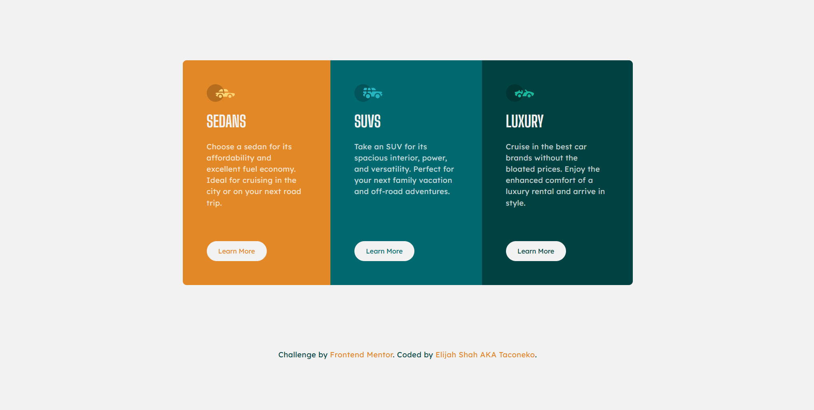

# Frontend Mentor - 3-column preview card component solution

This is a solution to the [3-column preview card component challenge on Frontend Mentor](https://www.frontendmentor.io/challenges/3column-preview-card-component-pH92eAR2-). Frontend Mentor challenges help you improve your coding skills by building realistic projects. 

## Table of contents

- [Overview](#overview)
  - [The challenge](#the-challenge)
  - [Screenshot](#screenshot)
  - [Links](#links)
- [My process](#my-process)
  - [Built with](#built-with)
  - [What I learned](#what-i-learned)
  - [Continued development](#continued-development)
  - [Useful resources](#useful-resources)
- [Author](#author)

## Overview

I timed myself for this challenge to see how long it takes me to complete a layout like this. The result: an hour, give or take. I think that's pretty decent, but once I get better I can probably halve that time.

### The challenge

Users should be able to:

- View the optimal layout depending on their device's screen size
- See hover states for interactive elements

### Screenshot

### Links

- Solution URL: [Add solution URL here](https://your-solution-url.com)
- Live Site URL: [Add live site URL here](https://your-live-site-url.com)

## My process

I left my SCSS files a bit messier this time around. After all, I don't *really* need a separate file for buttons if there's only one type of button, do I? Okay, in a real project I'd still make one just in case I was asked to make more buttons, or a variant, but I don't feel the need to do it for these.

Also, this was my first time using a sr-only class. For previous challenges, I was able to get away with making the text into the `h1`, but in this one there's nothing fitting.

### Built with

- Semantic HTML5 markup
- CSS custom properties
- Flexbox

### What I learned

Turns out, using a desktop-first workflow is much easier for me and results in (to me) a more readable file.

Right now, I use media queries whenever it seems like the site is breaking beyond usability, which I think is a good approach. Sticking to hard numbers or a certain list of breakpoints only really works if you were given specific designs for those breakpoints.

### Continued development

I'm thinking of making some base SCSS files+folders that I can reuse for every project, to help my speed. It makes no sense to make the same files over and over.

### Useful resources

- [Enable](https://www.useragentman.com/enable/screen-reader-only-text.php) - I got the code for the sr-only class from here.

## Author

- Frontend Mentor - [@taco-neko](https://www.frontendmentor.io/profile/taco-neko)